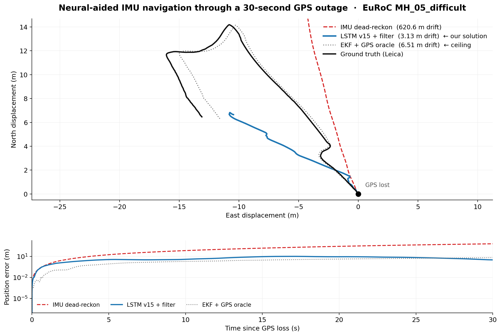
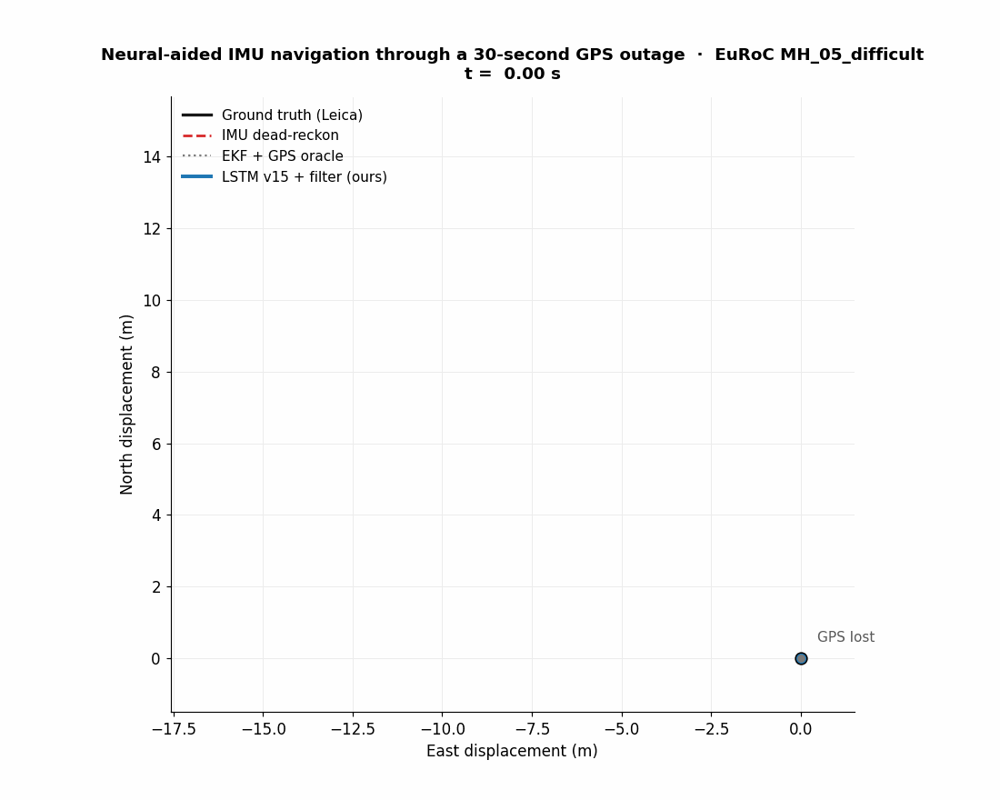
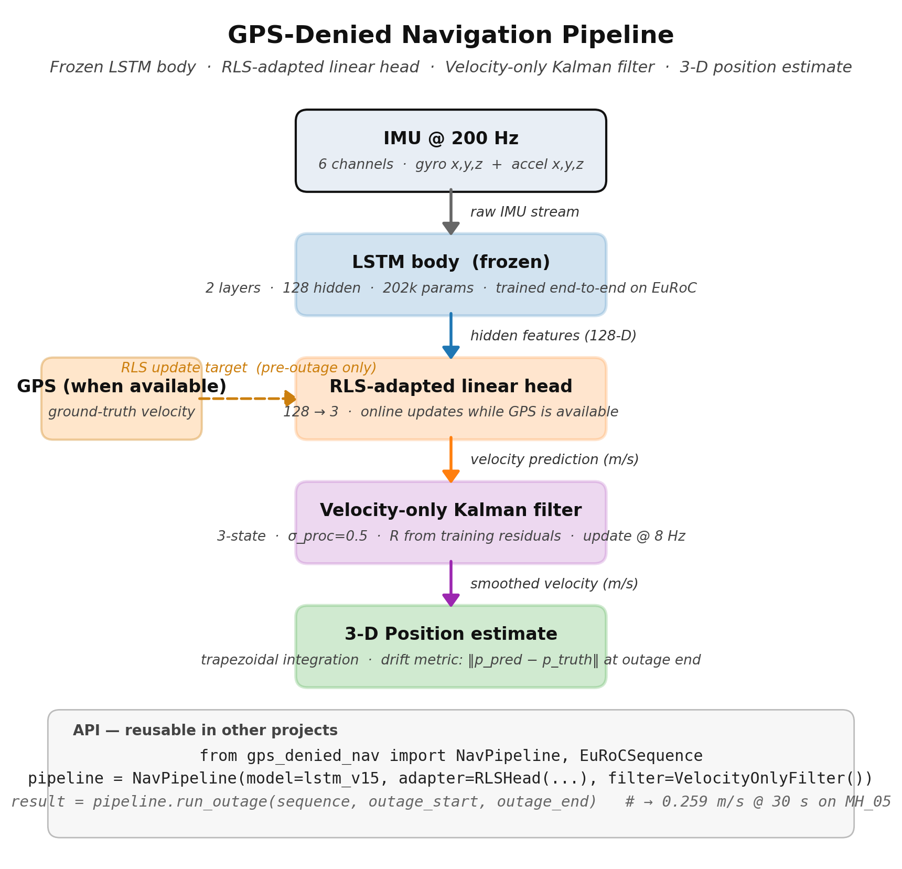
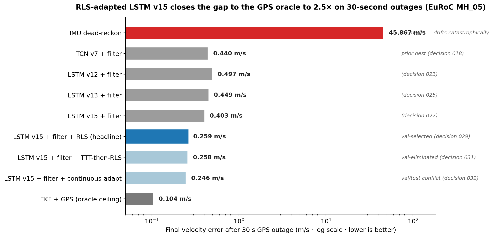
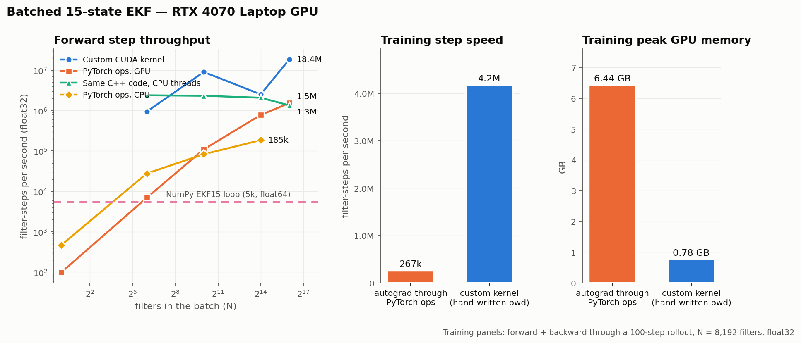
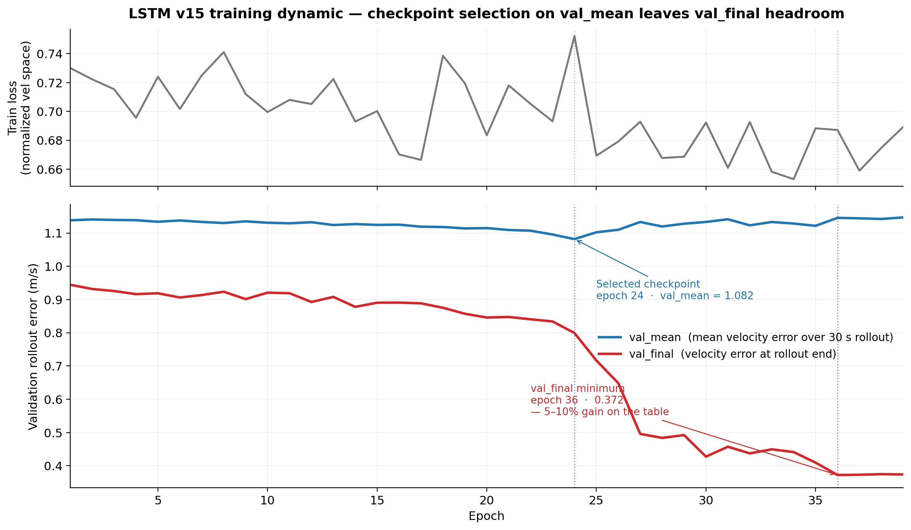

# GPS-Denied Navigation for UAVs

[](https://github.com/IshaanBansal2006/gps-denied-navigation/actions/workflows/ci.yml)
[](https://colab.research.google.com/github/IshaanBansal2006/gps-denied-navigation/blob/main/notebooks/demo.ipynb)
[](https://www.python.org/downloads/)
[](https://pytorch.org/)
[](LICENSE)

> Keep a drone navigated when GPS dies — **0.259 m/s final velocity error after a 30-second GPS outage** on EuRoC MH_05 (held-out test sequence). 2.5× the GPS-aided EKF oracle. 170× better than naïve IMU dead-reckoning.



The blue line is a neural-aided IMU navigator built from scratch in this repo, ending **3.13 m from ground truth** after a simulated 30-second GPS outage on EuRoC MH_05_difficult. The grey dotted line is a GPS-aided EKF oracle (the ceiling). The red dashed line is what would happen if you trusted the IMU alone.



---

## Architecture



Three composable parts: a frozen LSTM body, an online-adapted linear head, and a velocity-only Kalman filter. The whole thing is a 10-line program against the published `gps_denied_nav` API — see the snippet below.

---

## Headline result

**Final velocity error after a 30-second simulated GPS outage on EuRoC MH_05_difficult:**



| System | 30-s final velocity error | × GPS oracle | Where it lives |
|---|---:|---:|---|
| IMU dead-reckon (no model) | 45.867 m/s | 441× | — |
| TCN v7 + velocity-only filter | 0.440 m/s | 4.2× | decision [018](docs/decisions/018-ekf-outage-v7-comparison.md) |
| LSTM v13 + filter | 0.449 m/s | 4.3× | decision [025](docs/decisions/025-lstm-v13-navigation-eval.md) |
| LSTM v15 + filter | 0.403 m/s | 3.9× | decision [027](docs/decisions/027-lstm-v15-v16-loss-exploration.md) |
| **LSTM v15 + filter + RLS adaptation** | **0.259 m/s** | **2.5×** | decision [029](docs/decisions/029-rls-adaptation-head.md) |
| LSTM v15 + filter + TTT-then-RLS | 0.258 m/s | 2.5× | decision [031](docs/decisions/031-ttt-adaptation.md) — val-eliminated |
| LSTM v15 + filter + continuous-adapt (α=0) | 0.246 m/s | 2.4× | decision [032](docs/decisions/032-continuous-adaptation.md) — val/test conflict |
| EKF + GPS (oracle ceiling) | 0.104 m/s | 1.0× | — |

The **0.259 m/s** headline is the val-selected winner (RLS adaptation on top of v15 + filter). Continuous adaptation and TTT+RLS came in slightly better on test but didn't win on val — they're shipped as additional modules with honest write-ups, not promoted to the headline. See decisions 031 and 032 for the val/test methodology.

---

## Use this on your own drone

Full step-by-step walkthrough: [docs/use-on-your-own-data.md](docs/use-on-your-own-data.md).
Five-minute version:

```bash
pip install -e .
```

```python
from gps_denied_nav import NavPipeline, EuRoCSequence, OutageEvaluator
from gps_denied_nav.models import load_lstm_checkpoint
from gps_denied_nav.adaptation import RLSHead
from gps_denied_nav.filters import VelocityOnlyFilter
import torch

device = torch.device("cuda" if torch.cuda.is_available() else "cpu")
sequence = EuRoCSequence.load("MH_05_difficult", "data/sequences")
model, norm = load_lstm_checkpoint("checkpoints/lstm_v15.pt", device)

pipeline = NavPipeline(
    model=model,
    adapter=RLSHead(in_dim=128, out_dim=3, forgetting=0.995, p_init=0.1),
    filter=VelocityOnlyFilter(),
    norm=norm, device=device, update_stride=25,
)

# Evaluate one 30-second outage at 40% through the sequence
ev = OutageEvaluator(sequence, outage_start_frac=0.4)
result, metrics = ev.evaluate(pipeline, outage_duration_s=30.0)
print(f"Final velocity error: {metrics.final_velocity_error:.3f} m/s")
# → 0.2588 m/s
```

To run on your own data, drop in a class with the same shape as `EuRoCSequence` (timestamps, IMU @ rate, optional ground-truth velocity for the warmup) and the rest of the pipeline composes the same way. The adapter (`RLSHead`, `TTTAdapter`, `ContinuousAdapter`) and filter (`VelocityOnlyFilter`) are independent modules — swap any one of them out.

---

## Quickstart (5 minutes)

```bash
git clone https://github.com/IshaanBansal2006/gps-denied-navigation
cd gps-denied-navigation
pip install -e .
# Requires the EuRoC MH_05_difficult sequence preprocessed — see data/README.md
python3 scripts/neural_aided_ekf_lstm_v15_rls.py --outages 30
# → 0.259 m/s velocity error after 30 s GPS outage
```

Regenerate any figure:
```bash
python3 scripts/make_hero_figure.py
python3 scripts/make_trajectory_animation.py
python3 scripts/make_baseline_comparison_figure.py
python3 scripts/make_architecture_diagram.py
python3 scripts/make_loss_curves_figure.py
python3 scripts/make_cuda_ekf_figure.py
```

---

## GPU-batched differentiable EKF (custom CUDA)



The 15-state error-state EKF also exists as a C++/CUDA PyTorch extension: `gps_denied_nav/batched_ekf/`.

- **One GPU thread per filter.** Each thread runs the full predict + velocity-update step on stack arrays. One `__host__ __device__` header also compiles to a multithreaded CPU path.
- **Hand-derived backward kernel.** Written as closed-form VJPs through the Joseph update, the adjugate 3×3 inverse, the quaternion ops, and a Taylor-switched rotation-vector map. It recomputes the forward pass inside the backward thread, so only the step inputs are saved.
- **No dense 15×15 products.** Φ = I + F·dt and A = I − KH are applied as block operators.
- **Validated against PyTorch.** The forward pass matches the NumPy `EKF15` (rtol 1e-9), and gradients match PyTorch autograd (rtol 1e-8, plus `gradcheck`) on both CPU and GPU. Tested on an RTX 4070 Laptop and an RTX 2060.

| float32, RTX 4070 Laptop | PyTorch ops (autograd) | Custom kernel |
|---|---:|---:|
| Forward, N = 65,536 filters | 1.5M filter-steps/s | **18.4M** |
| Training step, N = 8,192, 100-step rollout | 267k filter-steps/s | **4.2M** (16×) |
| Training peak GPU memory | 6.4 GB | **0.78 GB** (8×) |

```python
from gps_denied_nav.batched_ekf.function import ekf_step_cuda   # drop-in for batched_ekf.ekf_step
x, P = ekf_step_cuda(x, P, imu, z, r, qc, mask, dt)             # (N,16), (N,15,15); differentiable
```

**What training through it found.** `scripts/learn_ekf_noise.py` learns the IMU noise and the LSTM measurement noise by backprop through batched 30-s outages on EuRoC, with selection on MH_04 and reporting on MH_05. The learned EKF improves on the hand-tuned EKF (mean outage error −8 %), but still doesn't beat the velocity-only filter. Gradient descent reached the same conclusion decision 019 reached by hand: the strapdown EKF's IMU propagation isn't trustworthy on this data. Details: decisions [033](docs/decisions/033-differentiable-batched-ekf-cuda.md)–[037](docs/decisions/037-learned-ekf-noise-through-cuda-kernels.md).

Build requirements: an NVIDIA GPU and `nvcc` 12.1 (`scripts/setup_cuda_toolchain.sh` installs it without sudo). The extension JIT-builds on first use, taking about 1 minute.

---

## Approach — the decision trail

This project ran 16 model variants, 9 nav-eval studies, and 37 decision docs. The high-leverage moves, in chronological order:

| Decision | What changed | Why it mattered |
|---|---|---|
| [015](docs/decisions/015-ekf-architecture-results.md) | Built the neural-aided EKF; defined the GPS-denied evaluation protocol | Established the evaluation discipline |
| [017](docs/decisions/017-tcn-v7-absolute-velocity-target.md) | Switched TCN from Δv → absolute v target | First model to break +0.09 R²; unblocked everything downstream |
| [019](docs/decisions/019-velocity-only-filter-beats-strapdown-ekf.md) | Replaced the strapdown EKF with a velocity-only filter | Attitude drift was poisoning IMU propagation within 10 s |
| [021](docs/decisions/021-tcn-v11-longer-window.md) | Window 1 s → 2 s, 3 conv layers → 6, RF 29 → 253 samples | R² jumped +66 %; temporal context was the bottleneck |
| [023](docs/decisions/023-lstm-v12-sequence-model.md) | Migrated TCN → dense LSTM | r²_mean from +0.158 → +0.203 |
| [024](docs/decisions/024-lstm-v13-velocity-weighted-loss.md) | Velocity-weighted loss | Fixed Z-axis: corr_z 0.253 → 0.375 (+48 %) |
| [027](docs/decisions/027-lstm-v15-v16-loss-exploration.md) | End-to-end navigation loss over 30-s rollouts (v15) | First model to break 0.45 m/s on 30-s final-position |
| [029](docs/decisions/029-rls-adaptation-head.md) | **RLS adaptation head — closed 30-s final-err 0.403 → 0.259** | Headline. Closes gap to oracle from 4× to 2.5× |
| [031](docs/decisions/031-ttt-adaptation.md) | Test-time training of the LSTM body | Negative result on in-distribution EuRoC; module shipped for future cross-dataset work |
| [032](docs/decisions/032-continuous-adaptation.md) | Self-supervised continuous adaptation during outage | Lost on val, won on test by 5 %; flagged val/test conflict honestly |
| [034](docs/decisions/034-cuda-forward-kernel.md)–[036](docs/decisions/036-sparse-jacobian-kernels.md) | Batched EKF as custom CUDA kernels with a hand-derived backward | 16× faster, 8× less memory than autograd for training through the filter |

Each decision doc contains the hypothesis, the result, and what was learned — including the negative results.

---

## What it took — v15 training dynamic



End-to-end nav loss is noisy (red line keeps falling even after `val_mean` plateaus). The selected checkpoint at epoch 24 may have left 5–10 % on the table — a follow-up retrain with `val_final` selection (v18) is in flight.

---

## What's honest about this

- **All numbers are on EuRoC MH_05_difficult**, the held-out test sequence. The RLS hyperparameters were originally tuned on the same sequence (decision 029 limitation). Cross-dataset eval is queued.
- The RLS adaptation **only helps at the 30-s outage horizon** the model was trained for. At 5, 10, or 60 s, vanilla v15 + filter is the safer pick (decision 029).
- Continuous adaptation (decision 032) **lost on val MH_04** (0.819 vs RLS's 0.750) but **won on test MH_05** (0.246 vs RLS's 0.259). The README headline conservatively stays at the val-selected number (0.259). Posting 0.246 as the headline would imply val-test consistency the experiment doesn't have.
- Test-time training of the LSTM body (decision 031) **does not help** on in-distribution EuRoC val. Module is shipped for cross-dataset experiments where domain shift gives it something to work on.
- The dead-reckoning baseline integrates body-frame acceleration *without* gravity compensation — the project's "naïve" baseline. A full strapdown INS without GPS would be less dramatic but still bad (decision 019).
- All training is on EuRoC (~1 km of indoor MAV flight). Generalization to other drones, other IMUs, outdoor flight is unknown.

---

## What's next (deferred experiments)

Full prioritized list with rationale: [docs/roadmap.md](docs/roadmap.md). Top of that list:

1. **Cross-dataset eval on TUM-VI or KITTI** — would unblock TTT (which needs domain shift) and validate the RLS / continuous adaptation findings outside MH_05.
2. **LoRA adapters on the LSTM gates** — middle ground between head-only RLS (decision 029) and full-model TTT (decision 031).
3. **Zero-velocity update (ZUPT) for continuous adapter** — needs a different dataset; EuRoC has no genuinely stationary windows.

---

## Layout

```
gps-denied-navigation/
├── gps_denied_nav/             ← pip-installable package
│   ├── models/                 (LSTM, TCN regressors)
│   ├── filters/                (15-state EKF, velocity-only filter)
│   ├── batched_ekf/            (differentiable batched EKF: PyTorch reference + C++/CUDA kernels)
│   ├── adaptation/             (RLSHead, TTTAdapter, ContinuousAdapter)
│   ├── data/                   (EuRoCSequence dataset class)
│   ├── pipeline.py             (NavPipeline composer)
│   └── eval.py                 (OutageEvaluator)
├── tests/                      (pytest unit tests; CUDA kernel tests skip without a GPU)
├── scripts/                    (training, nav-eval, figure scripts)
├── notebooks/demo.ipynb        (Colab-ready end-to-end demo)
├── data/sequences/             (per-sequence imu_aligned.csv)
├── checkpoints/                (trained model binaries — v7, v11–v15, v18)
├── results/                    (per-model nav-eval JSONs)
├── docs/
│   ├── decisions/              (dated decision docs)
│   ├── figures/                (hero, architecture, baseline, loss, GIF, CUDA benchmark)
│   ├── use-on-your-own-data.md (porting tutorial)
│   └── roadmap.md              (what I'd build next)
├── src/                        (backward-compat shims → gps_denied_nav.*)
├── .github/workflows/ci.yml    (pytest + mypy on push/PR)
├── pyproject.toml
├── setup.py
└── LICENSE
```

---

## Stack

Python 3.8+ · PyTorch 2.4 (CUDA 12.1) · custom C++/CUDA extension · NumPy · Pandas · Matplotlib · EuRoC MAV dataset

Trained on a single RTX 2060 (v15) and an RTX 4070 Laptop (v18). Inference runs end-to-end on a laptop CPU.

---

## License

MIT
